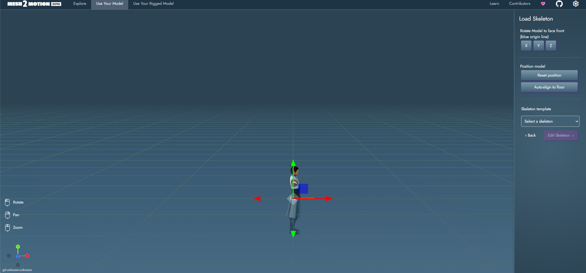
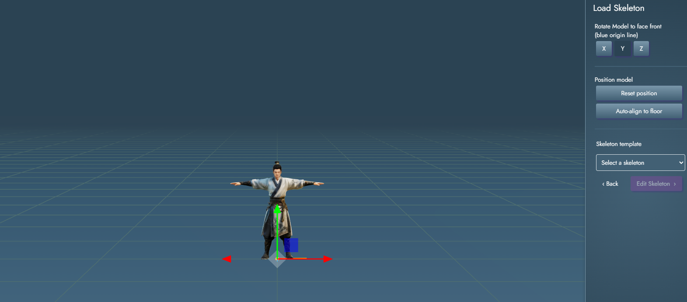
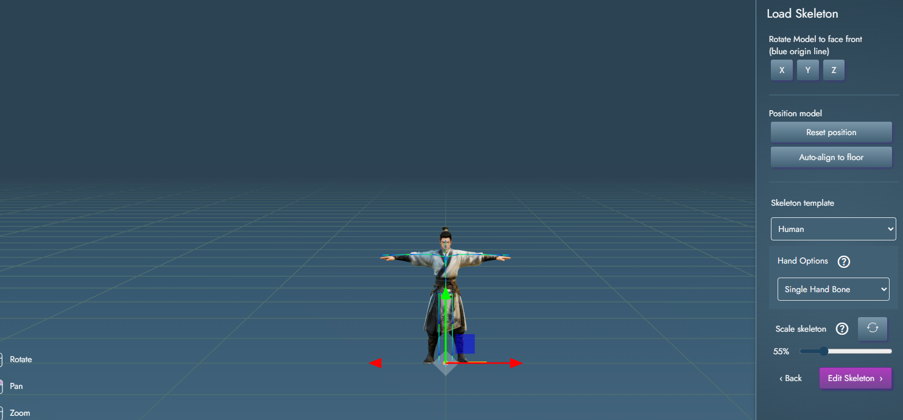
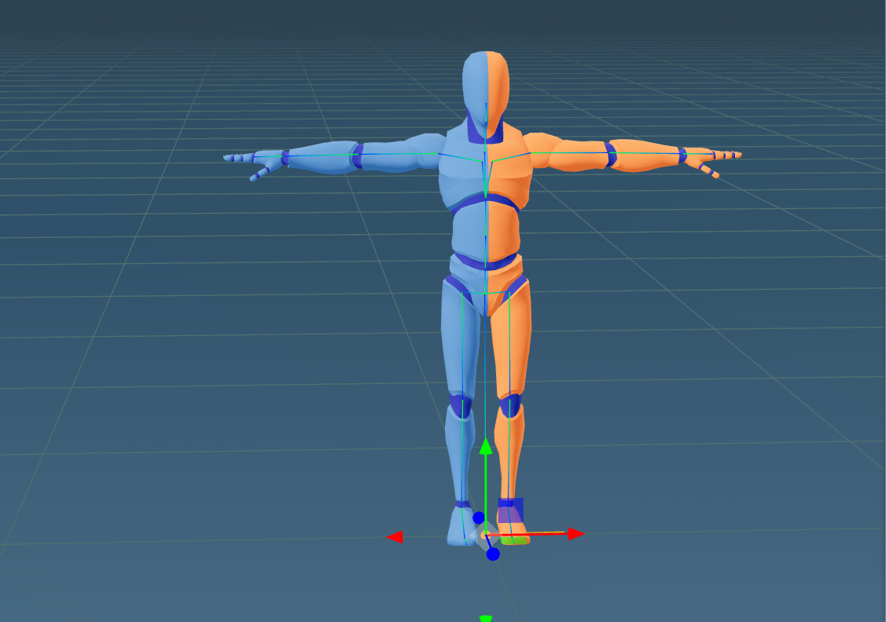
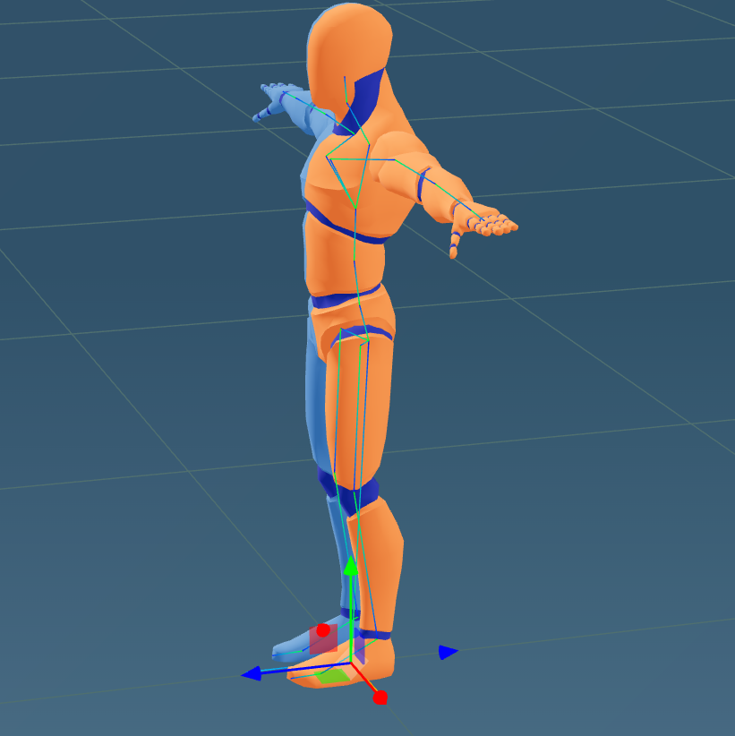
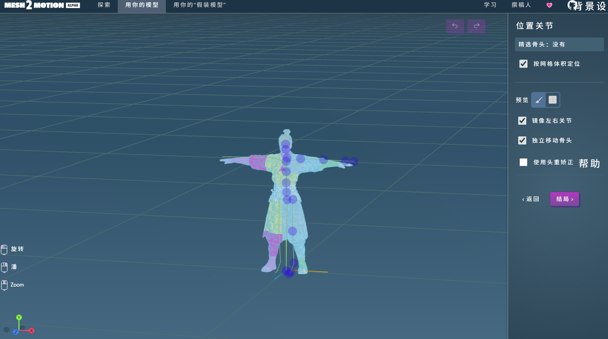
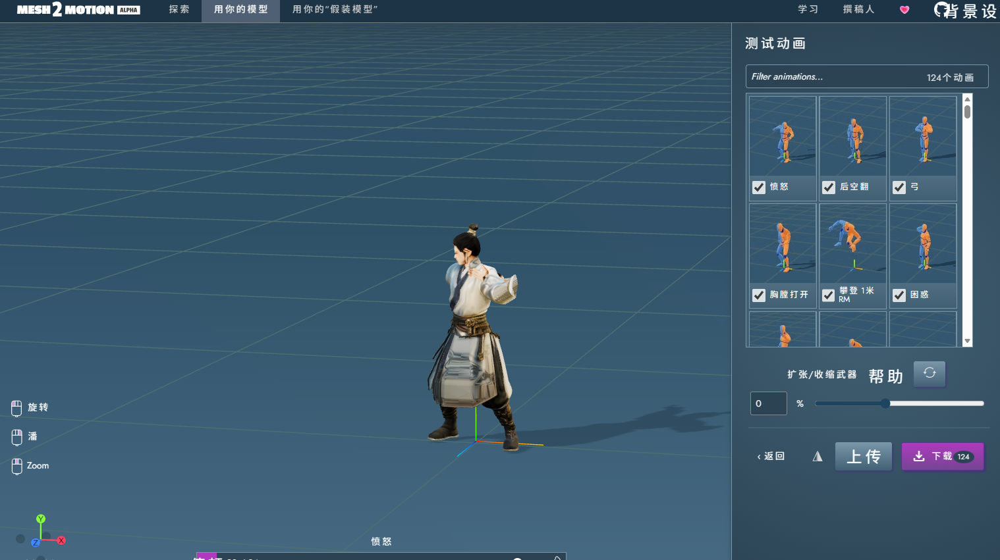

# 🐾 桌面伙伴 (Desktop Friend)

> 你的 Windows 桌面 AI 智能伙伴 - 基于 Electron + Live2D/GLTF 的桌面宠物应用
>
> ⚡ 本项目由 AI 辅助生成

[English](./README_en.md) | 简体中文

---

## ✨ 功能特点

### 🤖 AI 智能伙伴
- 支持接入各类 AI 大模型 API（OpenAI、Claude、本地模型等）
- 可自定义 AI 伙伴的性格设定
- 自然的对话交互体验

### 🎭 多模型支持
- **3D 模型**：支持 GLTF/GLB 格式的 3D 模型
- **Live2D 模型**：支持 Live2D 动态立绘
- **静态图片**：支持普通图片配合动画效果
- 模型管理面板，轻松切换不同形象

### 🎬 丰富的动画
- 内置大量 3D 动画（挥手、鼓掌、跳舞等 120+ 动画）
- 程序化动画效果
- 自动待机动作
- 可拖动、可交互

### 🛠️ 实用工具
- 💬 **AI 对话**：与伙伴实时聊天
- 📋 **待办事项**：管理日常任务
- ⏱️ **番茄钟**：专注工作与休息
- ⚡ **快捷操作**：快速打开常用应用

### 💻 桌面集成
- 🚀 **开机自启**：设置后开机即可见到伙伴
- 🔔 **系统托盘**：后台运行，快速访问
- 📌 **窗口置顶**：始终显示在桌面
- 🎯 **透明窗口**：不遮挡桌面背景

---

## 🎯 快速概览（6 步创建专属 AI 伙伴）

想要拥有一个基于你形象的 AI 桌面伙伴？只需 6 步：

1. 📸 **生成卡通形象** - 用 AI 将生活照转为卡通全身照
2. 🎭 **生成 3D 模型** - 用 AI 平台生成 GLB 格式的 3D 模型
3. 💃 **绑定骨骼动画** - 用 [Mesh2Motion](https://github.com/Mesh2Motion/mesh2motion-app) 生成动作
4. 🧠 **生成性格设定** - 用 AI 生成或蒸馏聊天记录创建专属性格
5. 🔑 **获取 API Key** - 在大模型平台注册获取
6. 🚀 **运行并配置** - 设置 API、性格、形象，如果不生效重启即可使用


---

## 🚀 快速开始

### 环境要求
- Windows 10 或更高版本
- Node.js 16+（建议使用 Node.js 18）
- npm 或 yarn

### 安装依赖

```bash
# 克隆项目
git clone <repository-url>
cd desktop-friend

# 安装依赖
npm install
```

### 运行开发版本

```bash
# 启动应用
npm start

# 或使用 UTF-8 编码启动（解决中文乱码）
npm run start:utf8
```

### 🏗️ 构建发布版本

```bash
# 构建 Windows 安装包
npm run build

# 或构建免安装版
npm run build:dir
```

构建完成后，安装包位于 `dist/` 目录。

---

## 📖 使用指南

### 🎨 完整使用流程

本程序需要一个完整的 AI 伙伴形象和性格设定。以下是从零开始创建专属 AI 伙伴的完整流程：

---

#### 第一步：生成卡通风格形象照

使用 AI 图像生成工具，将你的生活照转换为卡通风格的全身照片。


**推荐工具：**

- **元宝/豆包/即梦/通义万相/可灵** - 国内 AI 图像工具

**提示词示例：**
```
生成3d风格的人物全身图片，姿势面向前站直，双臂打开伸直，与肩平齐，手心朝下，图片9:16比例，背景透明
```


---

#### 第二步：生成 3D 模型（GLB 格式）

将卡通形象照上传到 AI 平台，生成 3D 人物模型。

**推荐平台：**

- **Tripo3D** (tripo3d.ai) - 快速生成带纹理的 3D 模型，可以使用我的推广链接（https://studio.tripo3d.ai?via=freejay）


**操作步骤：**
1. 上传卡通形象照
2. 模型一定要选择2.5版本才能免费导出，要求高质量请自费升级选择目标格式（ GLB）
3. 等待 AI 生成（约 1-5 分钟）
4. 下载 GLB 文件

> 💡 **注意**：建议选择正面站立姿态的模型，便于后续骨骼绑定。

---

#### 第三步：绑定骨骼并生成动作

使用开源工具为静态模型绑定骨骼，并生成带动画的 GLB 文件。

**推荐工具：**
- **Mesh2Motion** (https://github.com/Mesh2Motion/mesh2motion-app)
  - 专门用于将静态模型转换为带骨骼动画的 GLB
  - 支持多种预设动作（站立、行走、跳舞等）

**操作步骤：**
1. 打开 项目里面的体验网址，或者你自己拉代码到本地运行
2. 导入第二步下载的 GLB 模型
3. 选择目标骨骼模板（人形/卡通等）
4. 自动绑定骨骼
5. 选择动作库或生成自定义动作
6. 导出带动画的 GLB 文件

详细操作步骤：
1.选择页面上方选择Use Your Model，Upload上一步的得到的glb模型，点击auto-align to floor 把任务和地板对齐，点上方按Y轴旋转，让人物面向蓝色z轴方向；


2.Skeleton template选择Human-Single Hand Bone（人类，单手骨即没手指细节）,调整骨架比例Scale skeleton，让骨架基本和模型重合，一般是到54%左右；

3.点编辑骨骼（Edit Skeleton）,参考标准人形骨骼（Use Your Mode页面不Upload直接load就可以看到标准模型的骨骼绑定细节），把骨骼调整到和模型关节重合；



4.点击finish完成，勾选要导出的动作，点击export，导出glb模型,请保存好；



---

#### 第四步：生成 AI 伙伴性格文档

使用 AI 为你的伙伴生成独特的性格设定。

**方法一：AI 直接生成**
```markdown
# 伙伴性格设定

## 身份背景
我叫小雪，是一个活泼开朗的大学生...

## 性格特点
- 乐观积极，总是给人带来正能量
- 喜欢分享有趣的事情
- 会关心用户的情绪状态

## 说话风格
- 语气亲切自然
- 偶尔会使用可爱的颜文字
- 会根据话题适当调整表达方式
```

**方法二：蒸馏聊天记录（进阶）**
- 使用 GitHub 上的蒸馏项目，通过你的微信/QQ 聊天记录训练个性化性格
- 项目参考：类似 CharacterAI 的本地化蒸馏方案

> ⚠️ **数据安全提醒**：蒸馏聊天记录涉及个人隐私，请确保：
> 1. 脱敏处理后再上传（移除身份证号、银行卡、真实姓名等敏感信息）
> 2. 使用可信的本地部署方案
> 3. **本项目正在计划开发微信聊天记录的本地脱敏工具**，脱敏后再传给大模型蒸馏

---

#### 第五步：获取 AI 大模型 API Key

前往各大模型平台注册账号并获取 API Key，我用的是阿里百炼，我的推广链接：https://www.aliyun.com/minisite/goods?userCode=rerzndi4。

**推荐平台：**

| 平台 | 特点 | 官网 |
|------|------|------|
| 阿里通义 | Qwen 系列中文优化 | https://bailian.console.aliyun.com |
| 火山方舟 | ERNIE 系列 | https://volcengine.com/L/oEXSZUuR0vU/|


> 💡 **方舟 Coding Plan** - 支持 Doubao、GLM、DeepSeek、Kimi、MiniMax 等模型，工具不限量！现在订阅 **9折优惠**，低至 **36元**，订阅越多越划算！
> 
> [立即订阅](https://volcengine.com/L/oEXSZUuR0vU/) | 邀请码：`TYCADEFV`

**获取步骤：**
1. 注册账号并完成实名认证
2. 进入 API Key 管理页面
3. 创建新的 API Key
4. 复制并妥善保存（不要泄露给他人）

---

#### 第六步：运行程序并配置

1. **启动程序**
   ```bash
   # 开发模式
   npm start
   
   # 或运行打包后的程序
   双击 dist/ 目录下的 .exe 文件
   ```

2. **设置 API Key**
   - 点击 ⚙️ 设置图标
   - 填写聊天 API 地址（如使用 阿里百炼 官方：`https://dashscope.aliyuncs.com/compatible-mode/v1/chat/completions`）
   - 填写 API Key
   - 填写模型 `qwen-turbo-latest`聊天对话很快

3. **设置伙伴性格**
   - 打开性格设定面板
   - 导入第四步生成的 `.md` 性格文档
   - 或直接粘贴自定义的提示词

4. **设置伙伴形象**
   - 点击 🎭 模型管理图标
   - 导入第三步生成的带动画 GLB 文件
   - 预览动画效果

5. **重启应用**
   - 配置完成后重启程序
   - 你的 AI 伙伴就会以新形象出现！

---

### 💬 基础对话功能

配置完成后，你可以：
- 点击 💬 图标打开聊天窗口
- 输入消息与 AI 伙伴对话
- 伙伴会做出相应动作和表情

### 快捷操作

| 操作 | 说明 |
|------|------|
| 打开设置 | 点击 ⚙️ 或右键 → 设置 |
| 打开模型管理 | 点击 🎭 |
| 打开聊天 | 点击 💬 |
| 打开开发者工具 | `Ctrl + Shift + I` 或 `F12` |
| 退出程序 | 右键托盘 → 退出 |

---

## 📁 项目结构

```
desktop-friend/
├── main.js                 # Electron 主进程
├── preload.js             # 预加载脚本
├── package.json           # 项目配置
├── assets/                # 资源文件
│   ├── icon.ico          # 应用图标
│   └── icon.png          # PNG 图标
├── models/               # 3D/Live2D 模型
├── src/                  # 渲染进程源码
│   ├── index.html        # 主界面
│   ├── chat-window.html   # 聊天窗口
│   ├── model-manager.html # 模型管理
│   ├── settings.html      # 设置页面
│   ├── scripts/           # JavaScript 脚本
│   │   ├── renderer.js    # 主渲染器
│   │   ├── gltf-renderer.js # 3D 模型渲染
│   │   ├── live2d-renderer.js # Live2D 渲染
│   │   └── ...
│   └── styles/            # CSS 样式
├── dist/                 # 构建输出
└── logs/                 # 日志文件
```

---

## ⚙️ 配置说明

### 配置文件位置

配置文件存储在用户目录：
```
C:\Users\<用户名>\AppData\Roaming\desktop-pet\config.json
```

### 主要配置项

| 配置项 | 说明 | 默认值 |
|--------|------|--------|
| apiEndpoint | AI API 地址 | 空 |
| apiKey | AI API 密钥 | 空 |
| apiProvider | API 提供商 | openai |
| model | AI 模型 | gpt-3.5-turbo |
| autoStart | 开机自启 | true |
| alwaysOnTop | 窗口置顶 | true |
| petName | 伙伴名称 | 空 |
| userName | 用户名称 | 空 |
| currentLive2DModel | 当前模型 | 默认模型 |

### 重置配置

如需重置所有配置，删除以下文件：
```powershell
Remove-Item "$env:APPDATA\desktop-pet\config.json" -Force
```

---

## 💝 捐赠支持

如果这个项目对你有帮助，欢迎通过以下方式支持开发者：

| 捐赠方式 | 二维码 |
|----------|--------|
| 微信支付 |  |
| 支付宝 |  |


---

## 🛠️ 专业服务

### 有偿部署服务

如果你不想自己配置，或遇到各种技术问题，我可以提供付费部署服务：

**服务内容：**
- ✅ 远程桌面协助部署（Windows）
- ✅ AI 模型注册与配置
- ✅ 3D 模型格式转换与优化
- ✅ 骨骼绑定与动画处理
- ✅ 程序个性化定制

**服务优势：**
- 🔒 **隐私保护**：所有操作通过远程桌面进行
- ⏱️ **快速响应**：一般问题当天解决
- 💰 **合理收费**：根据实际工作量定价，童叟无欺

**联系方式：**
- 📧 邮箱：[freejay0223@qq.com]
- 💬 微信：[FreeJojo0402]

> 💡 **远程部署说明**：我们使用远程控制软件（如 AnyDesk、向日葵）直接连接到你的电脑，在你的监督下完成所有操作。你可以随时看到屏幕内容，确保隐私安全。

---

## ⚠️ 免责声明

**请仔细阅读以下条款，使用本项目即表示同意接受以下免责声明：**

### 1. 数据安全责任

- 🔒 本程序所有配置数据（包括 API Key、性格设定等）均存储在用户本地设备
- 🔒 聊天记录蒸馏功能涉及个人隐私数据，**请自行负责数据脱敏和安全**
- 🔒 在使用任何在线工具进行模型训练或蒸馏前，请确保已移除身份证号、银行卡号、手机号、真实姓名等敏感信息
- ⚠️ 对于因数据泄露造成的任何损失，项目开发者不承担任何责任

### 2. AI 生成内容

- 🤖 本程序中的 AI 对话功能由第三方大模型提供，生成的内容不代表项目开发者的观点和立场
- 🤖 AI 生成的内容可能包含事实性错误、偏见或不当言论，请理性判断
- 🤖 用户需对通过本程序与 AI 对话产生的所有行为和后果负责

### 3. 模型文件来源

- 🎭 用户导入的 3D 模型文件需确保拥有合法使用权
- 🎭 不得使用侵犯他人知识产权的模型文件
- 🎭 项目开发者不对用户使用模型的行为承担任何责任

### 4. 软件使用

- 💻 本程序按"原样"提供，不提供任何明示或暗示的保证
- 💻 对于因使用本程序造成的任何直接或间接损失，项目开发者不承担责任
- 💻 本程序可能会出现 BUG 或兼容性问题，请谅解

---

## 📜 许可证

### MIT 许可证

本项目采用 **MIT 许可证**，这是目前最宽松的开源许可证之一：

```
MIT License

Copyright (c) 2024 Desktop Friend

Permission is hereby granted, free of charge, to any person obtaining a copy
of this software and associated documentation files (the "Software"), to deal
in the Software without restriction, including without limitation the rights
to use, copy, modify, merge, publish, distribute, sublicense, and/or sell
copies of the Software, and to permit persons to whom the Software is
furnished to do so, subject to the following conditions:

The above copyright notice and this permission notice shall be included in all
copies or substantial portions of the Software.

THE SOFTWARE IS PROVIDED "AS IS", WITHOUT WARRANTY OF ANY KIND, EXPRESS OR
IMPLIED, INCLUDING BUT NOT LIMITED TO THE WARRANTIES OF MERCHANTABILITY,
FITNESS FOR A PARTICULAR PURPOSE AND NONINFRINGEMENT. IN NO EVENT SHALL THE
AUTHORS OR COPYRIGHT HOLDERS BE LIABLE FOR ANY CLAIM, DAMAGES OR OTHER
LIABILITY, WHETHER IN AN ACTION OF CONTRACT, TORT OR OTHERWISE, ARISING FROM,
OUT OF OR IN CONNECTION WITH THE SOFTWARE OR THE USE OR OTHER DEALINGS IN THE
SOFTWARE.
```

**这意味着你可以：**
- ✅ 自由使用、复制、修改本项目
- ✅ 商业用途（有偿部署服务完全合法）
- ✅ 分发、私有化部署
- ✅ 进行二次开发和衍生产品

**只需满足：**
- 📝 保留原始版权声明

---

## 🔧 常见问题

### Q: 托盘图标不显示？
A: 点击任务栏的向上箭头展开隐藏图标区域，找到桌面伙伴图标。

### Q: 如何让托盘图标始终可见？
A: 右键任务栏 → 任务栏设置 → 通知区域 → 选择哪些图标显示在任务栏上 → 开启桌面伙伴。

### Q: 3D 模型加载失败？
A: 确保模型文件是有效的 GLTF/GLB 格式，且位于 models/ 目录。

### Q: AI 对话无法使用？
A: 检查 API 地址和密钥是否正确配置。

### Q: 如何导出/导入配置？
A: 在设置页面有导出/导入性格配置的功能。

### Q: 如何通过聊天记录生成个性化性格？
A: 可以使用 GitHub 上的蒸馏项目，通过微信/QQ 聊天记录训练个性化 AI 性格。
   ⚠️ **重要提醒**：蒸馏前务必自行脱敏处理聊天记录，移除身份证号、银行卡号、手机号等敏感信息。
   📌 本项目正在计划开发微信聊天记录的本地脱敏工具，脱敏后再传给大模型蒸馏，敬请期待。

### Q: 远程部署服务安全吗？
A: 我们使用远程控制软件直接连接到你的电脑，所有操作都在你的监督下进行。
   - 数据不经过第三方服务器
   - 你可以随时看到屏幕内容
   - 完成后可立即断开连接
   - 建议操作完成后更换 API Key

---

## 🛡️ 安全说明

- ⚠️ API 密钥等敏感信息存储在用户本地目录，不会包含在打包文件中
- 💡 建议定期备份配置文件：`%APPDATA%\desktop-pet\config.json`
- 🔒 不要将 API 密钥提交到代码仓库

---

## 📝 开发指南

### 添加新功能

1. 在 `src/` 目录下创建或修改文件
2. 如需添加新面板，参考现有的 HTML 结构
3. 使用 IPC 通信与主进程交互

### 调试技巧

- 打开开发者工具：`Ctrl + Shift + I`
- 查看日志文件：`%APPDATA%\desktop-pet\logs\app.log`

### 代码规范

- 使用 ESLint 进行代码检查
- 遵循 Electron 安全最佳实践
- 注意防止 XSS 攻击

---

## 🤝 贡献指南

欢迎提交 Issue 和 Pull Request！

1. Fork 本仓库
2. 创建特性分支 (`git checkout -b feature/AmazingFeature`)
3. 提交更改 (`git commit -m 'Add some AmazingFeature'`)
4. 推送到分支 (`git push origin feature/AmazingFeature`)
5. 创建 Pull Request

---

## 🙏 致谢

- [Electron](https://electronjs.org/) - 桌面应用框架
- [PixiJS Live2D Display](https://github.com/guansss/pixi-live2d-display) - Live2D 渲染
- [Three.js](https://threejs.org/) - 3D 渲染引擎
- [Lottie](https://airbnb.design/lottie/) - 动画解决方案


---

<p align="center">
  <strong>如果这个项目对你有帮助，请给一个 ⭐️</strong>
</p>
